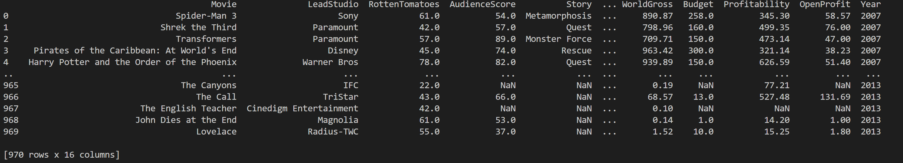
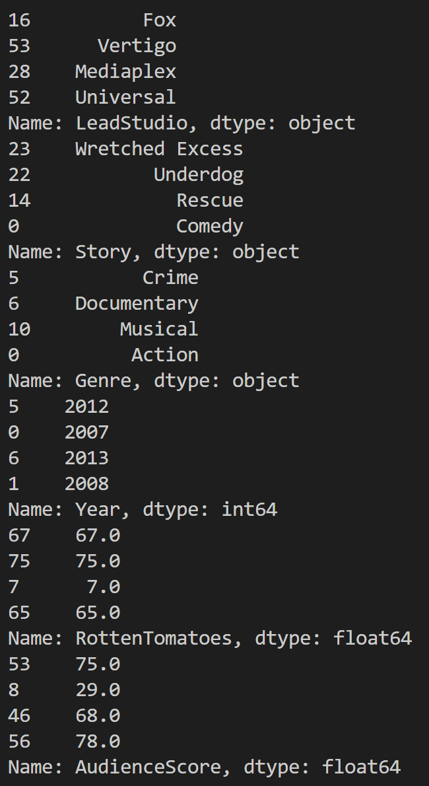
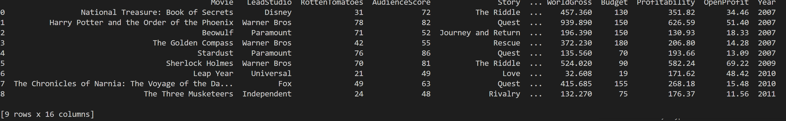
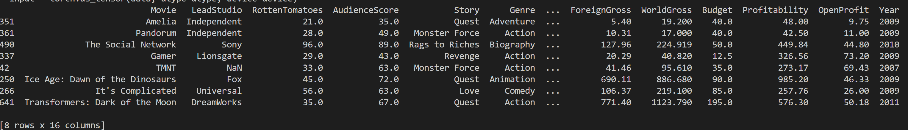

# SilverScreen
Movie Recommendations using torchhd in python (HDC/VSA)

## What is this repo about?
SilverScreen essentially does 2 things: <br>
  1. Does a Hard Exact Match based on Hamming Distance or Similarity which is analogous to the edit-distance problem for a given set of input parameters searching a library of movies.
  2. Does a Heuristic Search based on Cosine Similarity which tells how aligned the 2 hypervectors are essentially are in N-D space, and gives you a recommendation of movies based on your preference or liking list!

## What is N-D Space?
   * Essentially N-D Space is a Hyperspace with N Dimensions! Just like we are familiar with 3-D or Euclidean Space, this is an extension to that in N or more Dimensions! By the way, the 4th Dimension is of Time according to the theory of Relativity due to Einstein. But for the sake of simplicity and math to work we assume an N-Dimensional Model of it.

## So what is the N over here?
  * N is 10000 Dimensions in the program!

## Hmmm .... So what is so special about this Hyperspace?
  * The space consists of Tensors or Hypervectors! These are the basis or prime constituents of it. Living in this kind of space means that everything would be N-Dimensional.
  * That is ... all Data Structures, Algorithms, Variables, Operations etc. would be N-Dimensional.
  * We are virtually dealing with an N-Dimensional Super Computer here!!

## Okay ... so what does this N-D Super Computer do?
  * It has basically 3 Operations:
   1. Multiply (M) or Bind : Which is the Multiply or Bind Operation. Think of it as many different people co-authoring a book. They have their own opinions and their chapters would be dissimilar to the others to say.
   2. Add (A) or Bundle: which is the Add or Bundle Operation. Think of it as stacking together your bundle of favorite books, a collection that you are fond of and revere! This measures the likeness or Similarity between the hypervectors.
   3. Permute (P) or Shift : Which is nothing but shift left or right Operations. These are equivalent to changing the orientation of the hypervectors in the N-D Space! Think of it as changing the angles of the hypervectors in N-D space.
   <br>
   - Together these are called the MAP Tensor Model.
   - They are a part of the field called Hyper-Dimensional Computing or HDC.
   - Also the Computer Architecture is called Vector Symbolic Architecture or VSA.   

## Alright ... so does this mean that their benefits are N-fold?
  * Yes, there are many advantages of having the Computing setup in N-Dimensional Space! The productivity, resilience, error rate, performance & computation is N-fold advantageous. There are instances where the program has outperformed the traditional classical one by a factor of 300 or more! (300x)

## Great! So now how do I get started?
  * It's really very simple. First clone or download the repo in your local machine!
  * Ensure you have installed the latest Python Environment!
  * Then Run the following Commands to install the dependencies:
    ```
    pip install pandas
    pip install torch-hd
    ```   
  * To now Run the actual Program type:
    ```
     python movies.py
    ```
  * You should see the output like something as below:
   - The Movies Library
    
   - The Hamming Match or Exact Match Query Results
   ![hamming match]
   - The My Favorite or Liked Movie list
   
   - The Recommendations based on my Liking or preferences churned via Cosine Similarity
   

## Excellent! So where to next? ... from here?
  * Now that you have a grasp of the fundamental aspects of HDC & VSA, feel free to explore other applications & advanced concepts in this field!
  * Feel free to tinker with the code & change the Variables or Weights and see how the result manifests itself!!
  * Feel free to write your own programs and code in N-Dimensions!
  * With that said ... ***Happy Coding!!!***
  * And ... ***will see you soon in Hyperspace!!!***

**Cheers!!**
